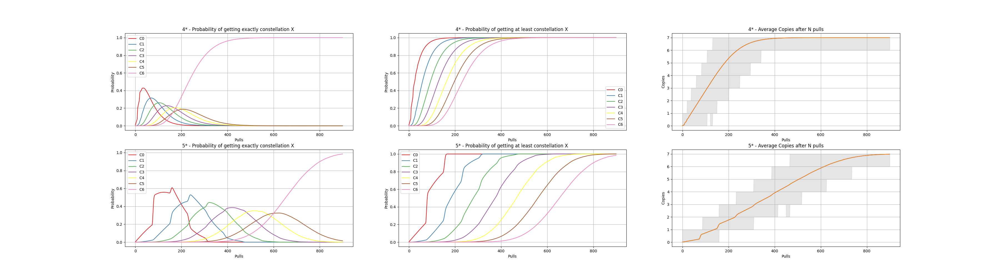

# Genshin Impact Gatcha Statistics

In this repo, we use a Monte Carlo Simulation in Numpy to estimate various statistics for Genshin Impact's Gatcha system. 
We calculate the probability of ending up at an exact constellation for one specific banner 4* or 5* after N pulls 
(1st column) and also the probability of getting at least constellation X after N pulls (2nd column). The third column
contains the average number of drawn copies for a specific character after N pulls.
The simulation always assumes that we start from 0 pity without a guaranteed 50/50 win.

The individual rates are taken from [Hoyolab](#https://www.hoyolab.com/article/497840). In particular, the average
chance of getting a 5* character before entering soft-pity at pull 74 is always 0.051. Starting at pull 74, soft pity
starts and linearly increases the chances of getting a 5* at each pull by 6% until we get a guaranteed 5* at 90 pulls.
For 4* characters, a similar soft pity system starts at 9 pulls after not getting at least a single 4* or 5* and results
in the well known guarantee for getting a 4* character every 10 pulls. For both 4* and 5* characters, the simulation
also takes into account that at least every other character is guaranteed to be from the banner. 

To run the simulation simply run:

> python calculate_wish_stats.py

The results are saved to 'simulation_results.png':

By default, we simulate 1.5 million trials of 900 pulls. If you want to use different values, simply use:

> python calculate_wish_stats.py --trials N --chain_length M

The project requires Numpy, Matplotlib, Seaborn and TQDM. To install them from the included requirements file, simply use:

> pip install -r requirements.txt

