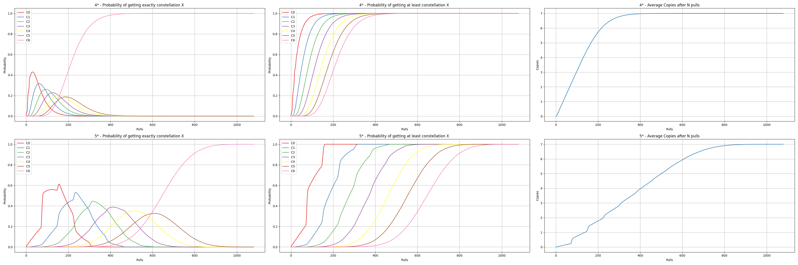

# Genshin Impact Gatcha Statistics

In this repo, we use a Monte Carlo Simulation in Numpy to estimate various statistics for Genshin Impact's Gatcha system. 
We calculate the probability of ending up at an exact constellation for one specific banner 4* or 5* after N pulls 
(1st column in plot) and also the probability of getting at least constellation X after N pulls (2nd column). The third column
contains the average number of drawn copies for a specific character after N pulls.
The simulation always assumes that we start from 0 pity without a guaranteed 50/50 win.

The individual rates are taken from [Hoyolab](https://www.hoyolab.com/article/497840). In particular, the average
chance of getting a 5* character before entering soft-pity at pull 74 is always 0.051. Starting at pull 74, soft pity
starts and linearly increases the chances of getting a 5* at each pull by 6% until we get a guaranteed 5* at 90 pulls.
For 4* characters, a similar soft pity system starts at 9 pulls after not getting at least a single 4* or 5* and results
in the well known guarantee for getting a 4* character every 10 pulls. For both 4* and 5* characters, the simulation
also takes into account that at least every other character is guaranteed to be from the banner. 

To run the simulation simply run:

> python calculate_wish_stats.py

The script will output Tables containing both the probabilities of getting exactly constellation N
and at least constellation N after a certain number of pulls into the results folder.
For example, the probabilities of getting exactly constellation X for the banner 5* after N pulls are:

5* - Probability of getting exactly constellation X

 Pulls |   C0   |   C1   |   C2   |   C3   |   C4   |   C5   |   C6   
-------|--------|--------|--------|--------|--------|--------|--------
   50  | 0.1372 | 0.0102 | 0.0005 | 0.0000 | 0.0000 | 0.0000 | 0.0000 
  100  | 0.5489 | 0.0822 | 0.0061 | 0.0004 | 0.0000 | 0.0000 | 0.0000 
  150  | 0.5657 | 0.2254 | 0.0342 | 0.0035 | 0.0003 | 0.0000 | 0.0000 
  200  | 0.4134 | 0.4335 | 0.1307 | 0.0200 | 0.0021 | 0.0002 | 0.0000 
  250  | 0.1236 | 0.5027 | 0.2922 | 0.0699 | 0.0103 | 0.0012 | 0.0001 
  300  | 0.0438 | 0.3569 | 0.3934 | 0.1627 | 0.0367 | 0.0058 | 0.0008 
  350  | 0.0000 | 0.1706 | 0.4161 | 0.2915 | 0.0977 | 0.0205 | 0.0037 
  400  | 0.0000 | 0.0408 | 0.3142 | 0.3835 | 0.1924 | 0.0558 | 0.0133 
  450  | 0.0000 | 0.0110 | 0.1738 | 0.3676 | 0.2881 | 0.1199 | 0.0396 
  500  | 0.0000 | 0.0000 | 0.0653 | 0.2806 | 0.3503 | 0.2074 | 0.0964 
  550  | 0.0000 | 0.0000 | 0.0134 | 0.1640 | 0.3377 | 0.2885 | 0.1964 
  600  | 0.0000 | 0.0000 | 0.0028 | 0.0746 | 0.2574 | 0.3252 | 0.3399 
  650  | 0.0000 | 0.0000 | 0.0000 | 0.0236 | 0.1588 | 0.3061 | 0.5116 
  700  | 0.0000 | 0.0000 | 0.0000 | 0.0044 | 0.0774 | 0.2380 | 0.6802 
  750  | 0.0000 | 0.0000 | 0.0000 | 0.0008 | 0.0302 | 0.1528 | 0.8163 
  800  | 0.0000 | 0.0000 | 0.0000 | 0.0000 | 0.0084 | 0.0801 | 0.9115 
  850  | 0.0000 | 0.0000 | 0.0000 | 0.0000 | 0.0015 | 0.0338 | 0.9647 
  900  | 0.0000 | 0.0000 | 0.0000 | 0.0000 | 0.0002 | 0.0116 | 0.9881 
  950  | 0.0000 | 0.0000 | 0.0000 | 0.0000 | 0.0000 | 0.0029 | 0.9971 
  1000 | 0.0000 | 0.0000 | 0.0000 | 0.0000 | 0.0000 | 0.0005 | 0.9995 
  1050 | 0.0000 | 0.0000 | 0.0000 | 0.0000 | 0.0000 | 0.0001 | 0.9999 
  1080 | 0.0000 | 0.0000 | 0.0000 | 0.0000 | 0.0000 | 0.0000 | 1.0000 

The results are also summarized in a plot and saved to 'results/simulation_results.png':

By default, we simulate 1.5 million trials of 1080 pulls. 
Running the script with default arguments has a peak memory consumption larger than 20GB. To reduce this, you can
simply run the simulation with less trials.

> python calculate_wish_stats.py --trials N --chain_length M

The project dependencies are given in 'requirements.txt'. To install them from the included file, simply use:

> pip install -r requirements.txt

